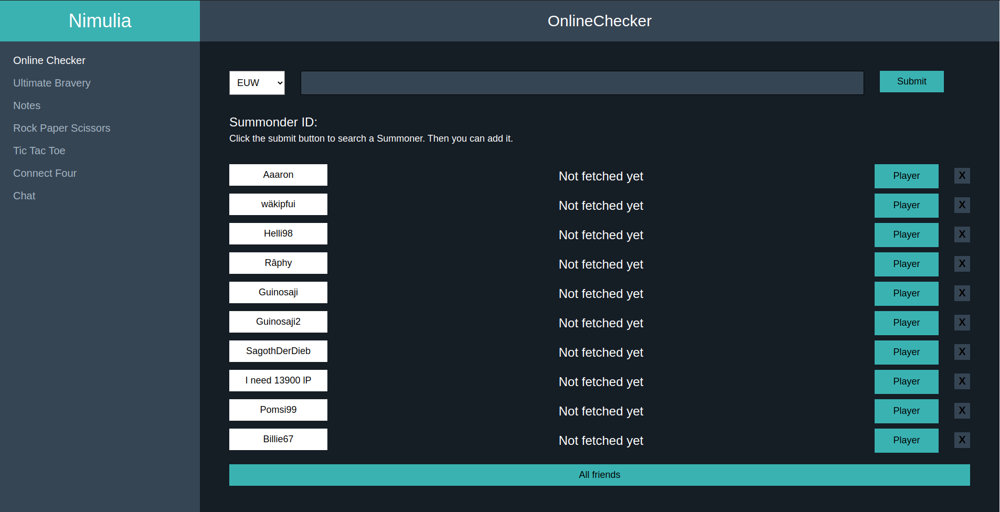

# Game-hub
Web Application for
- Check if players are online/offline, currentely in a game (for how long and with whom) for League of Legends using the official League of Legends API.
- Chat
- Play small games

## Motivation
The main functionality is the League of Legends Online checker.
For coding I personally like to use Linux. However the game League of Legends is running on Windows.
Therefore I had no option to check if my friends are currentely online. So if I wanted to play with them
I had to guess if they are online, and then swap OS and start League of Legends. In some situations I was 
wrong and they were offline or have just started a game, which takes at least 20min, which I then had to wait.
In order to solve my little problem I wrote this web application with which I could query the League of Legends API for my friends and it would tell me how many minutes they are already in a game, online or offline.  
The chat function and Minigames were just fun to add.

## How to run it
    $ git clone https://github.com/municola/game-hub.git
    $ npm install
    $ npm start

## Available Scripts 
In the project directory, you can run:

### `npm start`

Runs the app in the development mode.\
Open [http://localhost:3000](http://localhost:3000) to view it in the browser.

The page will reload if you make edits.\
You will also see any lint errors in the console.

### `npm test`

Launches the test runner in the interactive watch mode.\
See the section about [running tests](https://facebook.github.io/create-react-app/docs/running-tests) for more information.

### `npm run build`

Builds the app for production to the `build` folder.\
It correctly bundles React in production mode and optimizes the build for the best performance.

The build is minified and the filenames include the hashes.\
Your app is ready to be deployed!

See the section about [deployment](https://facebook.github.io/create-react-app/docs/deployment) for more information.

### `npm run eject`

**Note: this is a one-way operation. Once you `eject`, you can’t go back!**

If you aren’t satisfied with the build tool and configuration choices, you can `eject` at any time. This command will remove the single build dependency from your project.

Instead, it will copy all the configuration files and the transitive dependencies (webpack, Babel, ESLint, etc) right into your project so you have full control over them. All of the commands except `eject` will still work, but they will point to the copied scripts so you can tweak them. At this point you’re on your own.

You don’t have to ever use `eject`. The curated feature set is suitable for small and middle deployments, and you shouldn’t feel obligated to use this feature. However we understand that this tool wouldn’t be useful if you couldn’t customize it when you are ready for it.
